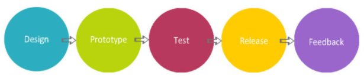
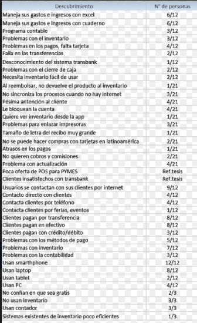
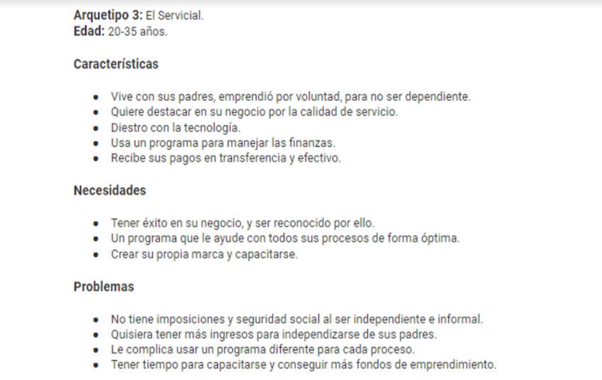
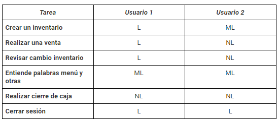

Replicar la app de Square POS
-----------------------------------------

Square POS es una de las mejores apps para punto de venta, sin embargo, no tiene aún soporte para latinoamérica. El reto consiste en crear una app parecida, pero adaptada a las necesidades de Chile en términos de flujos, monedas e impuestos.  
- ¿Qué funcionalidades debes priorizar?  
     - Catálogo de productos con precios y stocks.  
     - Cobros en efectivo y tarjeta de crédito (intenta usar un API).  
     - Cuadre de caja al final del día.  

Desarrollado para
------------------
Laboratoria

Participantes:
--------------------------
Equipo UX : Alexandra y Agustina.  
Equipo de front end : Lexis, Leticia y Pamela.

Reunión Kick off: (planning)
----------------------------
Presentacion de cada integrante del equipo.  
Conocernos y contarnos en que trabajamos mejor.  
Division del trabajo, priorizando tareas fundamentales a realizar en base al tiempo de entrega del producto.  

El proceso de diseño:
-----------------------

DESCUBRIMIENTO E INVESTIGACIÓN
-------------------------------
Conversaciones entre el equipo para poder analizar cuáles serían las metodologías a usar para el reto asignado.

### Definicion de nuestra audiencia:

Emprendedores de pequeña y mediana empresa (PYME) con un maximo de 300 clientes. 

### Investigacion:

- Script de entrevista para hacer un test de guerrilla a usuarios en comercios cercanos.
 
- Encuesta Online. 

- Benchmark 

- Analisis en terminos de Politica de inversion, flujos, monedas e impuestos en Chile.

- Reclamos en linea de los usuarios de la app.

SINTESIS Y DEFINICIÓN
----------------------------

Con todos los datos reunidos de las distintas etapas de la investigación, realizamos una síntesis de los descubrimientos.

- Creacion de tres User persona para definir tipo de usuarios que comparten una serie de características comunes. Deben recopilar información de:

### Ejemplo:

Ideación
----------------------

Considerando los principales funciones requeridas en el reto, y que uno de los problemas más comunes mencionado en la etapa de investigación fue el manejo del inventario, se decidió darle prioridad a la creación de la funcionalidad del inventario de la aplicación, considerando los siguientes elementos en cada producto del inventario:

- Imagen.  
- Nombre.  
- Valor.  
- Stock.  
- Opción de eliminar el producto del inventario.  
- Descontar el producto del stock una vez que se venda.  
- Agregar nuevos productos al inventario.  

TESTEO
------------------

Script de testeo square POS
-------------------------------

### Objetivos

- Detectar problemas en la navegación (si es fácil de usar e intuitiva).  
- Probar rapidez y facilidad en la creación de un inventario.  
- Detectar problemas en la navegación de una compra.  
- Detectar problemas o facilidad en el cierre de caja.  
- Averiguar si las traducciones de las palabras corresponden al vocabulario usado en Chile.  

### Tareas 

Usando la app square POS en su versión en español.  
Leyenda:  	L: Logrado 	ML: medianamente logrado	NL: No logrado

### Conclusiones

A los usuarios les resultó fácil crear categorías, pero les costó un poco entender que los artículos se creaban dentro de las categorías.  
No completaron todos los datos de los artículos en la creación. Después de un rato de uso e intentar vender se dieron cuenta de que se podía completar el valor del artículo, la cantidad de éstos, además del nombre y la imagen.  
Ambos usuarios manifestaron dudas con la pantalla de inicio, y cómo volver a ella. Ésto les generó gran conflicto.  
Además se sintieron muy inseguros con respecto a la forma de realizar una venta, e incluso uno de los usuarios no logró vender, no entendió las opciones del menú y que la aplicación le permitía hacer ventas.  
Ambos creen que el recibo de venta no es necesario, ya que es para ellas, no para el comprador.   
Ambos usuarios gustan del informe de ventas, aunque creen que es un poco extenso y que hay cosas que no usarían, como los descuentos por ejemplo.  
Les interesa ver cuánto vendieron, qué es lo que más vendieron, e incluso los horarios de más ventas. Les resultaría útil personalizar el informe de ventas según sus necesidades.  
Ambos presentaron gran confusión con las palabras del menú Proceso de pago y Transacciones.
En el inventario, la aplicación no descontó el artículo vendido.  
No encontraron la forma de cerrar la caja desde el celular, al parecer la aplicación no lo permite desde ese tipo de dispositivos.  
Cerrar sesión no les resultó difícil, pero preferirían que vaya dentro del menú, no dentro de los ajustes.  

### Con ésta retroalimentación, se decidió: 

- Hacer menos vistas, ya que los usuarios pedían que fuera lo más breve y sencillo posible, mientras menos clicks, mejor.  
- Eliminar el menú de hamburguesa, y dar acceso rápido a las principales secciones, que son inventario, teclado (para agregar los precios) y caja.  
- Usar palabras con las que el usuario chileno esté familiarizado, para facilitar el uso de la aplicación, ya que eso fue una de las principales razones de conflicto.  

Script de testeo vistas aplicación propia
-------------------------------------
### Objetivos

- Detectar problemas en la navegación (si es fácil de usar e intuitiva).  
- Probar rapidez y facilidad en la creación de un inventario.  
- Detectar problemas en la navegación de una compra.  
- Averiguar si las palabras reemplazadas corresponden al vocabulario usado en Chile.  

### Tareas

Usando las vistas del maquetado de nuestra aplicación.  
Leyenda:  	L: Logrado 	ML: medianamente logrado	NL: No logrado

### Conoce todos los detalles de cada etapa en Google Drive :
https://drive.google.com/drive/u/1/folders/1XLsnbcw4tOGEaTZCnJS0Saa8pzJTAcOb 

Conclusión y Recomendaciones:
---------------------------------

Dentro de los países de Latino América, Chile destacó por ser el país más atractivo en cuanto a potencial de mercado y plataformas tanto tecnológica como bancaria, convirtiéndose en candidato a ser sede de la expansión de Square hacia la región.

Se encontró que en el mercado de medios de pago Chileno, actualmente existe un monopolio liderado por Transbank y los bancos (principales accionistas), lo cual genera tal barreras de entradas que hacen que no sea posible ingresar.
A veces existen ocasiones donde los problemas se pueden convertir en grandes oportunidades, y quizás la actual condición existente en el mercado Chileno sea una de ellas. Actualmente existe una demanda generada por la Fiscalía Nacional Económica con respecto a la posición monopolista de Transbank, por lo que existe la posibilidad de que el mercado se abra a nuevos competidores generando grandes oportunidades.

